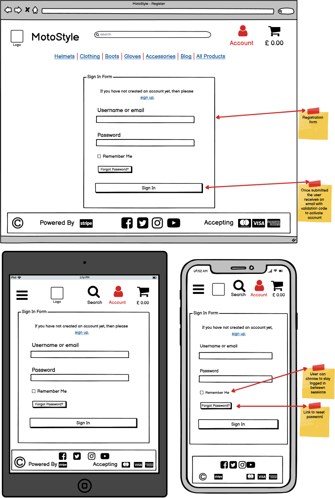
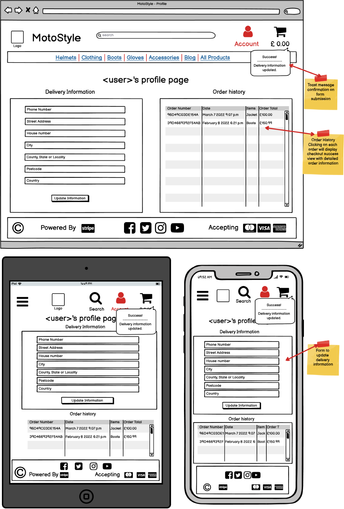
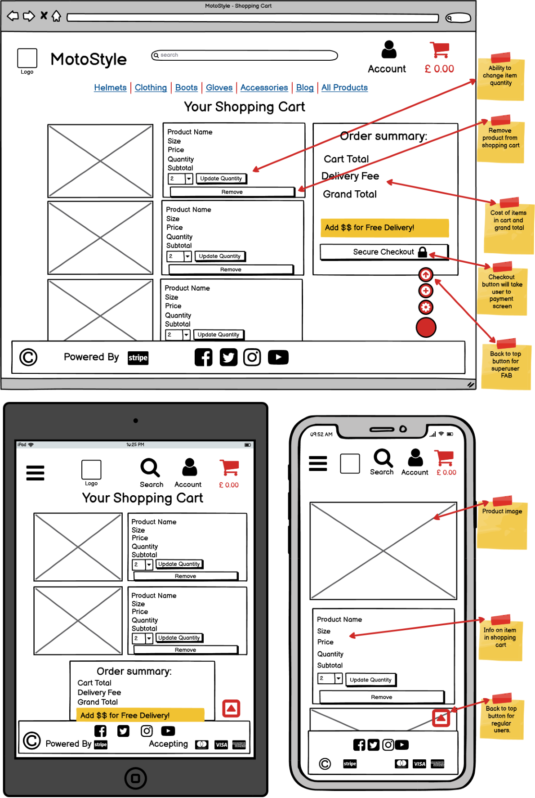
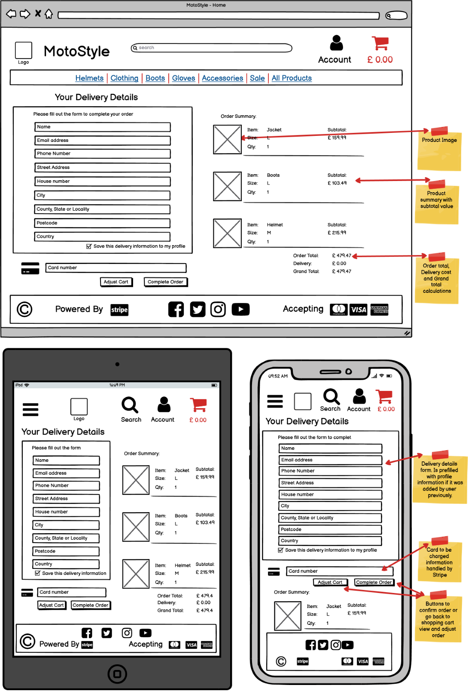

# **Moto Style**

## **Fourth Milestone Project - Full Stack Frameworks With Django - Code Institute**


# Table of Contents

- **[Project Overview](#project-overview)**
- **[User Experience](#user-experience)**
- **[Strategy](#strategy)**
  * **[Project Goals](#project-goals)**
  * **[User Goals](#user-goals)**
- **[Scope](#scope)**
  * **[User Stories](#user-stories)**
- **[Structure](#structure)**
  * **[Code Structure](#code-structure)**
  * **[Database Structure](#database-structure)**
    + **[Conceptual Database Model](#conceptual-database-model)**
    + **[Physical Database Model](#physical-database-model)**
  * **[Feature requirements](#feature-requirements)**
- **[Skeleton](#skeleton)**
  * **[Wireframes](#wireframes)**
  * **[App Routes](#app-routes)**
- **[Surface](#surface)**
  * **[Design](#design)**
- * **[Features](#features)**
    + **[Landing Page](#landing-page)**
    + **[Registration Page](#registration-page)**
    + **[Login Page](#login-page)**
    + **[My Shelf - User Collection Page](#my-shelf---user-collection-page)**
    + **[Add to Shelf Page](#add-to-shelf-page)**
    + **[Change Stock Page](#change-stock-page)**
    + **[Profile Page](#profile-page)**
    + **[Superuser Management Page Page](#superuser-management-page-page)**
    + **[Navbar](#navbar)**
    + **[Footer](#footer)**
    + **[Floating Action Button](#floating-action-button)**
    + **[Custom Error Pages](#custom-error-pages)**
  * **[Technologies Used](#technologies-used)**
  * **[Testing](#testing)**
  * **[Bugs](#bugs)**
  * **[Deployment](#deployment)**
  * **[Credits](#credits)**
  * **[Acknowledgements](#acknowledgements)**
  * **[Disclaimer](#disclaimer)**

## **You can find the deployed website** [**HERE**]()

# **Project Overview**

MotoStyle is a Full Stack e-commerce project developed as the final Milestone for Code Institute. It was created with Django Framework, using python as back-end and PostgreSQL as it's database while media is stored using AWS S3 services.
Purpose of the site is to enable a store to build a database of goods, showcase them and sell them online using stripe as the payment processor. 
The store owner has access to full CRUD functionality over the database and users of the site have access to CRUD functionality in the blog app over the content they add to the site.


**Registration on the website is open so feel free to take advantage of it. Regardless, for testing purposes I have set up the following account:**
* _Standard user:_ **testuser**  _password:_ **Password1**

# **User Experience**

This feature-rich e-commerce portal gives users access everything they need to make their shopping experience as complete as possible. Users are able to browse the products using a variety of sorting methods and search options. Once a product catches their eye, users have the options to add it to their wishlist or to their cart and purchase them using a safe payment processor - stripe. 
The reviews system allows them to post a review and a rating for each product as well as read other user's reviews. Once their shopping is complete, users have the option visit the blog section where they can post or read articles related to the motorcycle industry and community, as well as interact with each other in the comment sections.

# **Strategy**

##  **Project Goals**

* Use PostgreSQL to store data,
* Use Python and Django Framework to manipulate and present the data to the end-user,
* Use AWS to host and deliver media.
* Offer full CRUD functionality over the database to the store owners,
* Offer a responsive and mobile-friendly experience to users,

## **User Goals**

* Create an account on the site,
* Add products to the shopping cart,
* Purchase the items stored in the shopping cart,
* View reviews and articles related to the store's products,
* Interact with other users via the comments section,

# **Scope**

## **User Stories**

**New Users:** 

1. As a new user, I want to be able to create and register an account.
2. As a new user, I want to be able to login and access my account.
3. As a new user, I want to be able to logout.
4. As a new user, I want to browse the store's merchandise.
5. As a new user, I want to be able to search for specific products.
6. As a new user, I want to be able to browse by categories.
7. As a new user, I want to be able to order product lists by price, rating, category or name.
8. As a new user, I want to view individual product details.
10. As a new user, I want to select the different quantities and sizes for a product.
11. As a new user, I want to be able to add products to my shopping cart.
12. As a new user, I want to be able to add products to a list of interests(wishlist).
13. As a new user, I want to be able to view the total cost of my shopping cart while I browse.
14. As a new user, I want to access and view my shopping cart.
15. As a new user, I want to adjust and manage the products in my shopping cart.
16. As a new user, I want to be able to purchase the selected products by entering my payment information in a secure way.
17. As a new user, I want to view an order confirmation.
18. As a new user, I want to receive the order confirmation via e-mail also.

**Regular Users:**

19. As a regular user, I want to store my delivery information for easy future checkouts.
20. As a regular user, I want to view a record of my past orders.
21. As a regular user, I want to view and manage my wishlist.
22. As a regular user, I want to review, rate and read other user's reviews for the products on the site.
23. As a regular user, I want the ability to recover my password.
24. As a regular user, I want to view articles related to the store products and the community it caters to.
25. As a regular user I want to be able to post, edit or remove articles from the blog section.
26. As a regular user, I want to be able to comment on articles.

**Super Users:**

27. As a super user, I want to add products to the store.
28. As a super user, I want to edit existing products.
29. As a super user, I want to delete existing products.
30. As a super user, I want to access the administration portal.

**Site Owner:**

31. As a site owner, I want the site to be responsive.
32. As a site owner, I want to showcase my social media.
33. As a site owner, I want to provide feedback to the user based on their interactions with the site.
34. As a site owner, I want forms to be validated on the front-end for better user experience.
35. As a site owner, I want forms to be validated on the back-end in case front-end is bypassed or fails.


[Back to Top](#top-shelf)


# **Structure**

## **Code Structure**

Project is structured in separate apps, each app hosting the required files to run:

* moto_style :
    - asgi.py - It exposes the ASGI callable as a module-level variable named ``application``.
    - settings.py - Global settings for the project
    - urls.py - The `urlpatterns` list routes URLs to views. Connects all app routes to main project.
    - wsgi.py - It exposes the WSGI callable as a module-level variable named ``application``

* home app:
    - static/home folder:
        - js folder hosts the script for the image slider on the landing page
    - templates/home folder:
        - index.html - Template for the landing page. Extends base template
    - apps.py - Default Django generated app config file
    - urls.py - Routes used by the views for the home app
    - views.py - Defines all the views in the home app
    - test_views.py - Unit tests for the views in the home app

* products app:
    - fixtures folder - contains json format fixtures for the products that need to be loaded in the database
    - static/products folder:
        - js folder - hosts the scripts for form validation, image notification, select element and quantity buttons used by the templates in the products app
    - templates/products folder:
        - custom widget template
        - includes for the product sizes
        - add_product.html - Page for adding a product to the store
        - edit_product.html - Page for editing a product from the store
        - product_detail.html - Page for displaying individual products
        - products.html - Page for displaying multiple products based on query params
    - admin.py - Defines the models from the products app in the admin panel
    - apps.py - Default Django generated app config file
    - forms.py - Defines the forms used by the products app
    - models.py - Defines the models used by the products app
    - urls.py - Routes used by the views in the products app
    - views.py - Defines all the views in the products app
    - widgets.py - Modifies the default Django CustomClearableFileInput widget
    - test_forms.py - Unit tests for the forms in the products app
    - test_models.py - Unit tests for the models in the products app
    - test_views.py - Unit tests for the views in the products app

* profiles app:
    - templates/profiles folder:
        - profile.html - Page for displaying user profile page with delivery information and order history
    - apps.py - Default Django generated app config file
    - forms.py - Defines the forms used by the profiles app
    - models.py - Defines the models used by the profiles app
    - urls.py - Routes used by the views in the profiles app
    - views.py - Defines all the views in the profiles app
    - test_forms.py - Unit tests for the forms in the profiles app
    - test_models.py - Unit tests for the models in the profiles app
    - test_views.py - Unit tests for the views in the profiles app 

* cart app:
    - static/cart folder:
        - js folder - hosts the script for the quantity buttons
    - templates/cart folder:
        - cart.html - Page for displaying the users shopping cart
    - templatetags folder:
        - cart_tools.py - defines custom template tags used by the cart app
    - apps.py - Default Django generated app config file
    - contexts.py - Defines cart context to be accessible outside the cart app
    - urls.py - Routes used by the views in the cart app
    - views.py - Defines all the views in the cart app
    - test_views.py - Unit tests for the views in the cart app 
    
* checkout app:
    - static/checkout folder:
        - css folder - hosts all the css specific to the checkout app
        - js folder - hosts the script used by the stripe API
    - templates/checkout folder:
        - emails folder - hosts the templates for the automated emails
        - checkout.html - Page for displaying the checkout form
        - checkout_success.html - Page for displaying the checkout confirmation and order summary
    - admin.py - Defines the models from the checkout app in the admin panel
    - apps.py - Default Django generated app config file
    - forms.py - Defines the forms used by the checkout app
    - models.py - Defines the models used by the checkout app
    - signals.py - Handles signals on item change to update the order
    - urls.py - Routes used by the views in the checkout app
    - views.py - Defines all the views in the checkout app
    - webhooks.py - Defines the stripe webhook
    - webhook_handler.py - Defines how different stripe webhooks are handled by the app
    - test_forms.py - Unit tests for the forms in the checkout app
    - test_models.py - Unit tests for the models in the checkout app
    - test_views.py - Unit tests for the views in the checkout app

* blog app:
    - static/blog folder:
        - css folder - hosts all the css specific to the blog app
        - js folder - hosts the scripts for the image notification
    - templates/blog folder:
        - custom widget template
        - add_blog_post Page for adding a a post to the blog
        - edit_blog_post Page for editing a post from the blog
        - blog_post.html - Page for displaying individual posts
        - blog.html - Page for displaying all blog posts
    - admin.py - Defines the models from the blog app in the admin panel
    - apps.py - Default Django generated app config file
    - forms.py - Defines the forms used by the blog app
    - models.py - Defines the models used by the blog app
    - urls.py - Routes used by the views in the blog app
    - views.py - Defines all the views in the blog app
    - widgets.py - Modifies the default Django CustomClearableFileInput widget
    - test_forms.py - Unit tests for the forms in the blog app
    - test_models.py - Unit tests for the models in the blog app
    - test_views.py - Unit tests for the views in the blog app

* wishlist app:
    - templates/wishlist folder:
        - wishlist.html - Page for displaying the products on the user's wishlist
    - admin.py - Defines the models from the wishlist app in the admin panel
    - apps.py - Default Django generated app config file
    - models.py - Defines the models used by the wishlist app
    - urls.py - Routes used by the views in the wishlist app
    - views.py - Defines all the views in the wishlist app
    - test_views.py - Unit tests for the views in the wishlist app

* static folder:
    - css folder: holds the project's global css
    - js folder: holds the scrips used globally

* templates folder:
    - allauth folder: hosts the 3rd party allauth app's templates that have been customized for this project
    - includes folder: hosts the includes used globally for the toasts, floating action button, main nav and mobile top header
    - reviews folder: hosts the 3rd party rated_reviews app's templates that have been customized for this project
    - 400.html, 403.html, 404.html, 500.html - custom error page
    - base.html - The base template for the project to be extended by each app's templates

* custom_storages.py - Defines the Media and Static storage locations for S3Boto3

* manage.py - Default Django generated command-line utility for administrative tasks.

* requirements.txt - contains information on python dependencies used for this app.

## **Database Structure**

MotoStyle makes use of relational PostgreSQL for production environment and SQLite for development environment.

### **Conceptual Database Model**

Database concept was created using [QuickDBD](https://www.quickdatabasediagrams.com).

<details>
  <summary> (Expand) Conceptual Database Structure.</summary>


</details>

### **Physical Database Model**

Database schema was generated with the Django extension [Graph Models](https://django-extensions.readthedocs.io/en/latest/graph_models.html#selecting-a-library)

<details>
  <summary> (Expand) Physical Database Structure.</summary>


</details>

### **Database Models**

Models used by this project are defined for each individual app in the `models.py` modules.

* **User model fields:**
Is imported from Allauth library.

    - id int pk
    - date_joined DateTimeField
    - email EmailField
    - username CharField
    - first_name CharField
    - last_name CharField
    - is_active BooleanField
    - is_staff BooleanField
    - is_superuser BooleanField
    - last_login DateTimeField
    - password CharField

* **User Profile model fields:**
Defined in the profiles app.

    - id int pk
    - user OneToOneField FK >- User.id
    - default_full_name  CharField(50)
    - default_email EmailField(254)
    - default_phone_number CharField(20)
    - default_address_line1 CharField(80)
    - default_address_line2 CharField(80)
    - default_postcode CharField(20)
    - default_town_or_city CharField(40)
    - default_area CharField(80)
    - default_country CountryField(2)

* **Category model fields:**
Defined in the products app.

    - id int pk
    - name CharField(254)
    - friendly_name CharField(254)
    - description TextField
    - image ImageField
    - image_url URLField(1024)

* **Product model fields:**
Defined in the products app.

    - id int pk
    - category ForeignKey FK >- Category.id
    - sku CharField(254)
    - name CharField(254)
    - description TestField
    - price DecimalField
    - rating DecimalField
    - image_url URLField(1024)
    - image ImageField
    - has_sizes BooleanField

* **Wishlist model fields:**
Defined in the wishlist app.

    - id int pk
    - owner ForeignKey FK >- User.id
    - product ForeignKey FK >- Product.id

* **Review model fields:**
Imported from Rated Reviews library.

    - id int pk
    - content_type ForeignKey FK >- ContentType.id
    - site ForeignKey FK >- Site.id
    - user ForeignKey FK >- User.id
    - comment TextField
    - ip_address GenericIPAddressField
    - is_public BooleanField
    - object_pk TextField
    - rating PositiveSmallIntegerField
    - submit_date DateTimeField
    - weight PositiveSmallIntegerField

* **OrderLineItem model fields:**
Defined in the checkout app.

    - id int pk
    - order int FK >- Order.id
    - product int FK >- Product.id
    - product_size CharField(2)
    - quantity int
    - lineitem_total DecimalField

* **Oder model fields:**
Defined in the checkout app.

    - id int pk
    - user_profile ForeignKey FK >- UserProfile.id
    - order_number CharField(32)
    - full_name CharField(254)
    - email EmailField(254)
    - phone_number CharField(20)
    - address_line1 CharField(80)
    - address_line2 (CharField(80)
    - postcode CharField(20)
    - town_or_city CharField(40)
    - area CharField(80)
    - country CountryField(2)
    - date DateTimeField
    - delivery_cost DecimalField
    - order_total DecimalField
    - grand_total DecimalField
    - original_cart TestField
    - stripe_pid CharField(254)

* **BlogPost model fields:**
Defined in the blog app.

    - id int pk
    - owner ForeignKey FK >- User.id
    - title CharField(254)
    - content TextField
    - image ImageField
    - image_url URLField(1024)
    - second_image ImageField
    - second_image_url URLField(1024)
    - third_image ImageField
    - third_image_url URLField(1024)
    - fourth_image ImageField
    - fourth_image_url URLField(1024)
    - fifth_image ImageField
    - fifth_image_url URLField(1024)
    - created_at DateTimeField

* **Comment model fields:**
Defined in the blog app.

    - id int pk
    - blog_article ForeignKey FK >- BlogPost.id
    - poste_by ForeignKey FK >- User.id
    - comment_body TextField(200)
    - posted_at DateTimeField


## **Feature requirements**

* Responsive app for all device sizes.
* Collapsible Navigation bar on small devices.
* Footer with social media links.
* Landing Page showcasing (Read) items from the database.
* Registration Page with form validation.
* Login Page with form validation.
* Logout functionality with confirmation dialog.
* Search feature for products in the store.
* Sorting feature for products in the store by category, name, rating, price.
* Page where superusers can add products (Create entries) in the database.
* Administration Page where superusers can edit product details (Update entries) from the database.
* Superuser access to Delete feature with confirmation dialog for products in the database.
* Profile Page where users can Update personal details and view order history.
* Shopping cart where users can add products and is adjustable before checkout.
* Checkout feature secured by a safe payment provider [Stripe](https://stripe.com/gb).
* User access to wishlist feature where they can save favorite products for later purchase.
* User access to post reviews (Create entries) for products in the store.
* User access to post blog articles (Create entries) in the database.
* User access to edit blog articles (Update entries) in the database.
* User access to Delete feature with confirmation dialog for blog articles.
* User access to post comments (Create entries) in the database for blog articles.
* Notification system (message toast) to provide users with feedback to their interactions with the site.
* Administration panel for store owner with full CRUD control over the database.

[Back to Top](#top-shelf)

# **Skeleton**

## **Wireframes**

<details>
  <summary> (Expand) Landing Page Wireframes.</summary>


</details>

<details>
  <summary> (Expand) Registration Page Wireframes.</summary>


</details>

<details>
  <summary> (Expand) Login Page Wireframes.</summary>


</details>

<details>
  <summary> (Expand) Products Page Wireframes.</summary>


</details>

<details>
  <summary> (Expand) Product Details Page Wireframes.</summary>


</details>

<details>
  <summary> (Expand) Add product to Database Page Wireframes.</summary>


</details>

<details>
  <summary> (Expand) Update product from the Database Page Wireframes.</summary>


</details>

<details>
  <summary> (Expand) Profile Page Wireframes.</summary>


</details>

<details>
  <summary> (Expand) Wishlist Page Wireframes.</summary>


</details>

<details>
  <summary> (Expand) Shopping Cart Page Wireframes.</summary>


</details>

<details>
  <summary> (Expand) Checkout Page Wireframes.</summary>


</details>

<details>
  <summary> (Expand) Checkout Success Page Wireframes.</summary>


</details>

<details>
  <summary> (Expand) Blog Page Wireframes.</summary>


</details>

<details>
  <summary> (Expand) Blog Post Page Wireframes.</summary>


</details>

<details>
  <summary> (Expand) Add Blog Post Page Wireframes.</summary>


</details>

<details>
  <summary> (Expand) Update Blog Page Wireframes.</summary>


</details>

## **Project Routes**

**Home Route**
* Accessible from the Navbar Logo.
* Django path: `/`, view name: `home`.

**Registration Route**
* Accessible when logged out from the Account dropdown -> Register link in the top header navigation.
* Redirects to home page if already logged in.
* Django path: `/accounts/signup/`, view name: `account_signup`.

**Login Route**
* Accessible when logged out from the Account dropdown, -> Login link in the top header navigation.
* Redirects to home page if already logged in.
* Django path: `/accounts/login/`, view name: `account_login`.

**Products Route**
* Accessible from any of the category selections, filter or search queries.
* Django path: `/products/`, view name: `products`.

**Product Detail Route**
* Accessible by clicking on the product card displayed in `products`.
* Django path: `/products/<int:product_id>/`, view name: `products_detail`.

**Add Product Route**
* Accessible only by superusers by expanding the Floating Action Button (FAB) in the bottom right corner and selecting the second button with the "+" icon.
* Redirects to home page and displays and error message if not superuser.
* Redirects to login page if not logged in.
* Django path: `/products/add/`, view name: `add_product`.

**Update Product Route**
* Accessible only by superusers by clicking the button with a pencil icon on any of the product presentation cards or the product detail page.
* Redirects to home page and displays and error message if not superuser.
* Redirects to login page if not logged in.
* Django path: `/products/edit/<int:product_id>/`, view name: `edit_product`.

**Delete Product Route**
* Accessible only by superusers by clicking the button with a rubbish bin icon on any of the product presentation cards or the product detail page.
* Redirects to home page and displays and error message if not superuser.
* Redirects to login page if not logged in.
* Django path: `/products/delete/<int:product_id>/`, view name: `delete_product`.

**Profile Route**
* Accessible when logged in from the Account dropdown -> Profile link in the top header navigation.
* Redirects to login page if not logged in.
* Django path: `/profile/`, view name: `profile`.

**Order History Route**
* Accessible when logged in from the Profile page by clicking on the order number.
* Redirects to login page if not logged in.
* Django path: `/profile/order_history/<order_number>`, view name: `order history`.

**Wishlist Route**
* Accessible when logged in from the Account dropdown -> Wishlist link in the top header navigation.
* Redirects to login page if not logged in.
* Django path: `/wishlist/`, view name: `view_wishlist`.

**Wishlist Add Route**
* Accessible when logged in by clicking the Add to wishlist link on the product detail page.
* Redirects to login page if not logged in.
* Django path: `/wishlist/add/<product_id>/`, view name: `add_to_wishlist`.

**Wishlist Remove Route**
* Accessible when logged in by clicking the Remove from wishlist link on the product detail page.
* Redirects to login page if not logged in.
* Django path: `/wishlist/remove/<product_id>/`, view name: `remove_from_wishlist`.

**Cart Route**
* Accessible by clicking on the cart link with a shopping cart icon in the top header navigation.
* Django path: `/cart/`, view name: `view_cart`.

**Add to Cart Route**
* Accessible by clicking the add to cart button on the product detail page.
* Django path: `/cart/add/<item_id>/`, view name: `add_to_cart`.

**Update Cart Route**
* Accessible by clicking Update Quantity button for each product on the shopping cart page.
* Django path: `/cart/adjust/<item_id>/`, view name: `adjust_cart`.

**Remove from Cart Route**
* Accessible by clicking the Remove button for each product on the shopping cart page.
* Django path: `/cart/remove/<item_id>/`, view name `remove_from_cart`.

**Checkout Route**
* Accessible by clicking the Secure Checkout button on the shopping cart page or the toast success message.
* Django path: `/checkout/`, view name: `checkout`.

**Checkout Success**
* Presented to the user after clicking Complete Checkout button on the checkout page and checkout form is validated.
* Django path: `/checkout/checkout_success/<order_number>`, view name: `checkout_success`.

**Cache Checkout Data Route**
* Used internally by the checkout app and not accessible by users.
* Django path: `/checkout/cache_checkout_data/`, view name: `cache_checkout_data`.

**Webhook Route**
* Used by the stripe API and not accessible by users.
* Django path: `/checkout/wh/`, view name: `webhook`.

**Blog Route**
* Accessible by clicking on the blog link in the main navigation menu.
* Django path: `/blog/`, view name: `blog`.

**Blog Post Route**
* Accessible by clicking the Read More button from the blog post previews in the accordion on the blog page.
* Django path: `/blog/<int:blog_post_id>/`, view name: `blog_post`.

**Add Blog Post Route**
* Accessible when logged in by clicking the Post Article button on the blog page.
* Redirects to login page if not logged in.
* Django path: `/blog/add/`, view name: `add_blog_post`.

**Update Blog Post Route**
* Accessible only by superusers or user that created the post.
* Redirect to blog page and displays an error if accessed without permission.
* Redirects to login page if not logged in.
* Django path: `/blog/edit/<int:blog_post_id>/`, view name: `edit_blog_post`.

**Delete Blog Post Route**
* Accessible only by superusers or user that created the post.
* Redirect to blog page and displays an error if accessed without permission.
* Redirects to login page if not logged in.
* Django path: `/blog/delete/<int:blog_post_id>/`, view name: `delete_blog_post`.

**Delete Comment Route**
* Accessible only by superusers or user that created the post.
* Redirect to blog page and displays an error if accessed without permission.
* Redirects to login page if not logged in.
* Django path: `/delete_comment/<int:comment_id>/`, view name: `delete_comment`.

Routes used by third party apps like [Allauth](https://django-allauth.readthedocs.io/en/latest/installation.html) and [Rated Reviews](https://django-rated-reviews.readthedocs.io/en/stable/) can be found in their respective documentation on [Read the Docs](https://readthedocs.org)

[Back to Top](#top-shelf)

# **Surface**

## **Design**

The MotoStyle project was designed with a mobile-first concept focusing on delivering to the user a feature-rich e-commerce experience that is responsive and functional on any device size. 


<details>
  <summary> (Expand) Design tablet.</summary>


</details>

<details>
  <summary> (Expand) Design mobile.</summary>


</details>


**UI**

MotoStyle makes use of the [Bootstrap 5.1](https://getbootstrap.com) CSS Framework which is directed at responsive, mobile-first front-end web development.

Two identities were created to highlight responsiveness:


**Typography**

As the app is using Bootstrap library it inherits a lot of it's fonts as fallback. For the main components I have opted to overwrite those fonts with Lexend font family which was created with the intent to reduce visual stress and so improve reading performance.

**Color Palette**


[Back to Top](#top-shelf)


# **Features**

This projects features are accessible to the user based on their account permissions.
| Nav Link                  | Not logged in     | Logged in as user | Logged in as admin |
| ---                       | ---               | ---               | ---       |
| Home                      |&#9989;            |&#9989;            |&#9989;    |
| Register                  |&#9989;            |&#10060;           |&#10060;   |
| Log in                    |&#9989;            |&#10060;           |&#10060;   |
| Log out                   |&#10060;           |&#9989;            |&#9989;    |    
| Profile                   |&#10060;           |&#9989;            |&#9989;    |    
| Order History             |&#10060;           |&#9989;            |&#9989;    |    
| Wishlist                  |&#10060;           |&#9989;            |&#9989;    |    
| Add to wishlist           |&#10060;           |&#9989;            |&#9989;    |    
| Remove from wishlist      |&#10060;           |&#9989;            |&#9989;    |    
| Products                  |&#9989;            |&#9989;            |&#9989;    |    
| Product Detail            |&#9989;            |&#9989;            |&#9989;    |    
| Product Detail (Review)   |&#10060;           |&#9989;            |&#9989;    |    
| Product Add               |&#10060;           |&#10060;           |&#9989;    |    
| Product Update            |&#10060;           |&#10060;           |&#9989;    |    
| Product Delete            |&#10060;           |&#10060;           |&#9989;    |    
| Blog                      |&#9989;            |&#9989;            |&#9989;    |    
| Blog Post                 |&#9989;            |&#9989;            |&#9989;    |    
| Blog Post (Comment)       |&#10060;           |&#9989;            |&#9989;    |
| Blog Post (Comment Delete)|&#10060;           |&#10060; (except owner)          |&#9989;    |      
| Blog Post Add             |&#10060;           |&#9989;            |&#9989;    |    
| Blog Post Update          |&#10060;           |&#10060; (except owner)          |&#9989;    |    
| Blog Post Delete          |&#10060;           |&#10060; (except owner)          |&#9989;    |    
| Cart                      |&#9989;            |&#9989;            |&#9989;    |    
| Checkout                  |&#9989;            |&#9989;            |&#9989;    |    
| Checkout success          |&#9989;            |&#9989;            |&#9989;    |
| Administration Panel      |&#10060;           |&#10060;           |&#9989;    | 


### **Landing Page**

The Landing Page features the hero image and the search feature at the top of the page which users are able to take advantage of and search the database for a specific product. Main content of the page is comprised of a slider featuring the highest rated products in the store. The slider's width is responsive to the user's device size.

*User stories solved by this feature:*

* 4 - As a new user, I want to browse the store's merchandise.
* 5 - As a new user, I want to be able to search for specific products.
* 31 - As a site owner, I want the site to be responsive.

<details>
  <summary> (Expand) Landing Page on mobile, tablet and desktop view.</summary>


</details>


### **Registration Feature**

Registration page is comprised of the registration form which is used to CREATE an user entry in the database User model for the Allauth app. The form is validated on the front-end by a custom JQuery script as well as on the back-end, providing feedback to the user when validation errors occur.

*User stories solved by this feature:*

* 1 - As a new user, I want to be able to create and register an account.
* 33 - As a site owner, I want to provide feedback to the user based on their interactions with the site.
* 34 - As a site owner, I want forms to be validated on the front-end for better user experience.
* 35 - As a site owner, I want forms to be validated on the back-end in case front-end is bypassed or fails.

<details>
  <summary> (Expand) Registration Page on mobile, tablet and desktop view.</summary>


</details>


### **Login Feature**

Login page is comprised of the login form which is used to READ an user entry from the database User model for the Allauth app. The form is validated on the back-end, providing feedback to the user input does not match the database entry. The login form hosts a "Forgot Password?" link that will allow the user to reset their password.


*User stories solved by this feature:*

* 2 - As a new user, I want to be able to login and access my account.
* 23 - As a regular user, I want the ability to recover my password.
* 33 - As a site owner, I want to provide feedback to the user based on their interactions with the site.
* 35 - As a site owner, I want forms to be validated on the back-end in case front-end is bypassed or fails.


<details>
  <summary> (Expand) Login Page on mobile, tablet and desktop view.</summary>


</details>


### **User Profile Feature**

The Profile Page enables users to store and update their delivery information for future checkouts and provides a order history list. Clicking on the order numbers in this list will provide the user a detailed order record.

*User stories solved by this feature:*

* 19 - As a regular user, I want to store my delivery information for easy future checkouts.
* 20 - As a regular user, I want to view a record of my past orders.

<details>
  <summary> (Expand) Profile Page on mobile, tablet and desktop view.</summary>


</details>


### **Products Display Feature**

This feature provides the user with the ability to view all products, narrow down results by category/categories and sort them by their attributes. Clicking on a specific item will bring the user to the product's detail page where they are able to view detailed information, add the product their wishlist, read other user's reviews or rate and review the product themselves. After selecting their desired size and quantity the user is able to add the product to their shopping cart for later purchase.

*User stories solved by this feature:*

* 4 - As a new user, I want to browse the store's merchandise.
* 6 - As a new user, I want to be able to browse by categories.
* 7 - As a new user, I want to be able to order product lists by price, rating, category or name.
* 8 - As a new user, I want to view individual product details.
* 9 - As a new user, I want to select the different quantities and sizes for a product.
* 10 - As a new user, I want to be able to add products to my shopping cart.
* 11 - As a new user, I want to be able to add products to a list of interests(wishlist).
* 22 - As a regular user, I want to review, rate and read other user's reviews for the products on the site.

<details>
  <summary> (Expand) Products Page on mobile, tablet and desktop view.</summary>


</details>

[Back to Top](#top-shelf)

### **Navbar**

The navigation bar houses the app's Logo and the main navigation links.
The links accessible will change based on wether the user is logged in or logged out.
It is collapsible on small devices and the side navigation is accessible from the burger menu on the right hand side.
Messages being flashed to the user as feedback for their interactions with the app are displayed in the section right under the navbar.

*User stories solved by this feature:*

* 15 - As a site owner, I want the app to be responsive.
* 18 - As a site owner, I want to provide feedback to the user when errors occur.

<details>
  <summary> (Expand) Navbar </summary>


</details>


### **Footer**

In the footer, the user can find links the owner's social media.

*User stories solved by this feature:*

* 17 - As a site owner, I want to showcase my social media.

<details>
  <summary> (Expand) Footer </summary>


</details>

### **Floating Action Button**

The floating action button at the bottom right hand side corner of the page extends to provide extra functionality to the user. It can be used to go back to the top of the page or to logout.

While on their profile page, Superusers will find the regular floating action button replaced with a different one that links to the Superuser Administration Page.

*User stories solved by this feature:*

* 3 - As a new user, I want to be able to logout.

<details>
  <summary> (Expand) Floating Action Button </summary>


</details>

### **Custom Error Pages**

The Error Pages are displayed in case an error occurs on client, server or database side. It provides the user with the ability to go back to one of the webapp pages and maintains user engagement.
Each error page displays it's specific error in the title. The user can still use the app's navbar to navigate or click the big button in the middle of the page to return to the Landing Page.
The errors that have specific routes on backend are:

* 400 Bad Request,
* 401 Unauthorized (RFC 7235),
* 404 Not Found,
* 405 Method Not Allowed,
* 500 Internal Server Error

*User stories solved by this feature:*

*

<details>
  <summary> (expand) Error Page</summary>


</details>

[Back to Top](#top-shelf)

## **Technologies Used**

* **[HTML5](https://html.spec.whatwg.org)**
* **[CSS 3](https://www.w3.org/Style/CSS/Overview.en.html)**
* **[JavaScript](https://www.javascript.com)**
* **[Python 3.9.6](https://www.python.org)**
* **[JQuery 3.6.0](https://jquery.com)** Was used for dom manipulation.
* **[Flask](https://flask.palletsprojects.com/en/2.0.x/)** Was used as the framework for the app.
* **[Jinja](https://jinja.palletsprojects.com/en/3.0.x/)** As the template engine for Flask.
* **[MaterializeCSS](https://materializecss.com)** The app's main front-end framework.
* **[Github](https://github.com)** For storing my repository.
* **[Github Desktop](https://desktop.github.com)** For managing synchronizations between local and cloud-stored repositories.
* **[Git](https://git-scm.com)** For version control.
* **[VSCode](https://code.visualstudio.com)** IDE for writing code.
* **[Balsamiq](https://balsamiq.com) For designing the wireframes.
* **[Font Awesome](https://fontawesome.com)** Provided the icons for social media links.
* **[Google Fonts](https://fonts.google.com)** Ubuntu, Oxygen and Fira Sans font families were used as default fonts for the web application.
* **[Optimizilla](https://imagecompressor.com)** To optimize images for web applications.
* **[Favicon.io](https://favicon.io)** For creating the favicon.
* **[AmIResponsive](http://ami.responsivedesign.is)** For the multi-device mockup.
* **[Markdown ToC](https://ecotrust-canada.github.io/markdown-toc/)** Used to generate the table of contents for Readme.md

## **Testing**

Documentation on all tests carried out is available in [TESTING.md](/TESTING.md)

## **Bugs**

Documentation on all bugs and solutions is available in [TESTING.md](/TESTING.md)

## **Deployment**

The website is hosted [Github](https://github.com), deployed on [Heroku](https://id.heroku.com/login) and uses [MongoDB](https://www.mongodb.com) as it's database. To be able to deploy accounts need to be created on all 3 sites.

**Hosting Repository on Github:** 

1. Login into Github account,
2. Select the button marked "New" and create a new repository,
3. Open repository with favorite IDE.

**Creating MongoDB Database:**

1. Login into MongoDB,
2. Create a new project,
3. Under "Security" click "Database Access" and set up a user with read/write permissions,
4. Create a database cluster,
5. Click on the "Collections" tab and create the necessary collections,
6. Under "Security" click "Network Access" and add the specific IP of the application you are connecting to the database or use 0.0.0.0/0 to allow global access.
7. Under "Deployment" select "Databases" and click "Connect",
8. Click "Connect your application" and select Python v3.6 or later,
9. Copy the connection string generated (MONGO_URI) and replace <password> with the password for the root user. Replace myFirstDatabase with the name of the database that connections will use by default,


**Connecting app to the database:**

1. Create a env.py file in the root directory,
2. Set the environment variables:
```python
import os

os.environ.setdefault("IP", Enter IP here)
os.environ.setdefault("PORT", Enter PORT here)
os.environ.setdefault("SECRET_KEY", Enter your SECRET KEY)
os.environ.setdefault("MONGO_URI", Enter MONGO_URI received at step 9 when creating MongoDB)
os.environ.setdefault("MONGO_DBNAME", Enter name of the collection in the database)
```

**Deployment to Heroku:**

1. Create a Procfile in the root directory with contents `web:python app.py`,
2. Run `pip freeze > requirements.txt` in terminal,
3. Login into Heroku,
4. Click "Create new app",
5. As Deployment method select GitHub,
6. Select the relevant repository with the help of the search field and click Connect,
7. Click "Settings" and select "Reveal Config Vars",
8. Add the config vars used in env.py,
9. Select "Deploy Brach",
10. After deployment is successful enable automatic deploys. 


**Steps to follow to clone this repository:**

1. Log into your [Github](https://github.com) account,
2. Select the [Repository](https://github.com/CristianBuca/MS3_TopShelf),
3. Click on the drop-down menu title **Code** on the top right of the repository file tree,
4. Copy the HTTPS address,
5. In your Git Bash Terminal type *"git clone"* then paste the address.
6. Install all python dependencies by running this command in the terminal: `pip install -r requirements.txt`

*Alternatively you can download the repository as ZIP or use [Github Desktop](https://desktop.github.com) to get the repository on you local machine*

[Back to Top](#top-shelf)

## **Credits**

This Project was created based on the Code Institute - Flask Task Manager Project Lessons by Tim Nelson and Python Flask Tutorial - by [Corey Schafer](https://www.youtube.com/channel/UCCezIgC97PvUuR4_gbFUs5g). 
There are inevitable similarities between this project and the project from these 2 tutorials, more specifically:

**From Tim Nelson's lessons I used:**

* The app initialization method,
* Overall approach on building the app using Flask and Jinja,
* Structure of the routes.

**From Corey Schafer's tutorial I used:**

* The approach of form validation using [wtForms](https://wtforms.readthedocs.io/en/3.0.x/) in python.

**JQuery component initialization** is from [MaterializeCSS](https://materializecss.com).

**JQuery form validation** was done using the [Jquery Validation Plugin](https://jqueryvalidation.org/documentation/).

**Ajax method to replace broken links** solution is from [Sitepoint](https://www.sitepoint.com/jquery-replace-broken-images/).

**Media**

* Hero Image, Error page background image, default avatar and default item images from [Pexels](https://www.pexels.com/search/cryptocurrency/).
* Individual bottle images and information sourced from [Whisky Shop](https://www.whiskyshop.com) and [Whisky Hunter](https://whiskyhunter.net)

### **Code Institute colleagues who's work I followed for guidance:**

[Carla Buongiorno](https://github.com/CarlaBuongiorno/The-Collector).

[Paul Meeneghan](https://github.com/pmeeny/CI-MS3-FootballMemories).

[Irina Pozdeeva](https://github.com/irinatu17/MyCookBook).


## **Acknowledgements**

* Special thanks to my mentor Mo Shami for his suggestions and guidance.
* Special thanks to my brother for his feedback and suggestions.
* My family for their encouragement and support.
* The Code Institute tutors that helped me when I was hitting walls.
* The Code Institute team for all the effort and energy they put into creating and curating the content for this programme.

## Disclaimer

_This project is for educational use only and was created as a Milestone Project for the Code Institute Module of Interactive Frontend Development_

Developed by Cristian Buca

[Back to Top](#top-shelf)

